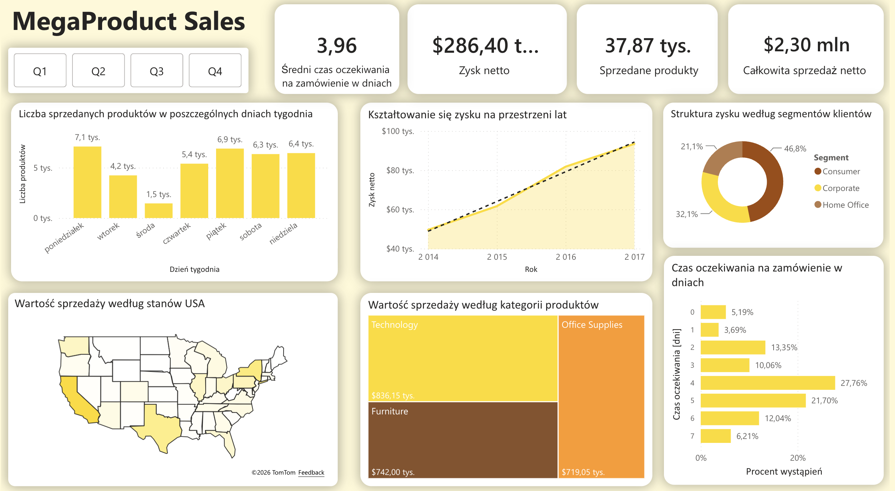
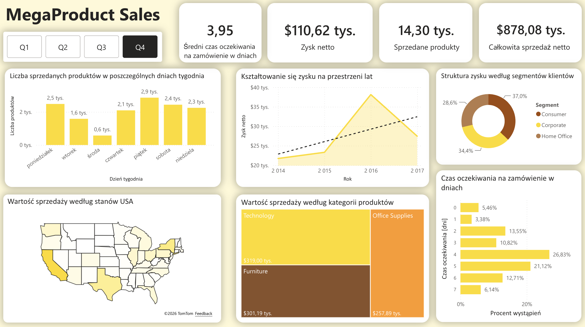

# Interactive Sales Dashboard 

## Overview 
Interactive business intelligence dashboard developed in Microsoft Power BI to analyse sales performance and provide valuable insights from data.

The project is focused on preparing raw data and transforming them into interactive dashboard using different visualisation techniques.

## Data Source

The dataset used in this project comes from Kaggle.

[Sales Dataset] (https://www.kaggle.com/datasets/vivek468/superstore-dataset-final)

## Tools & Technologies

- Microsoft Power BI 
- Power Query
- Dax

## Project Workflow

1. Downloading dataset from Kaggle and importing it into Power BI.
2. Cleaning and transforming data using Power Query.
3. Using DAX to create measures used in KPIs and different visualisations.
4. Desinging interactive dashboard.

## Dashboard Features

- KPIs card for crucial business metrics
- Profit over time
- Regional analysis using maps
- Customer segmentation
- Filters and drill-down functionality

## Dashboard Preview

